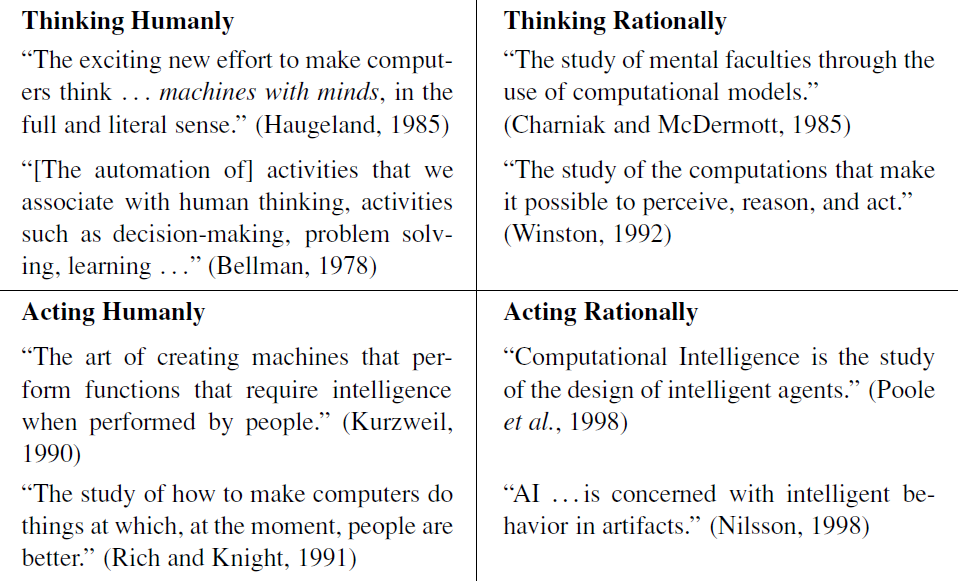

# Introduction
In this chapter we will see a quick introduction to AI like:
- What is AI?
- The foundations of AI
- The history of AI

## What is AI?
In Figure 1.1 we see eight definitions of AI, laid out along two dimensions. The definitions on top are concerned with *thought processes and reasoning*, whereas the ones on the bottom address *behavior*. The definitions on the left measure success in terms of fidelity to *human* performance, whereas RATIONALITY the ones on the right measure against an *ideal* performance measure, called **rationality**.

|  |
|:--:|
| **Figure1.1** *Some definitions of artificial intelligence, organized into four categories.* |

### Acting humanly: The Turing Test approach
The Turing test was created to provide a satisfactory operational definition of intelligence.
